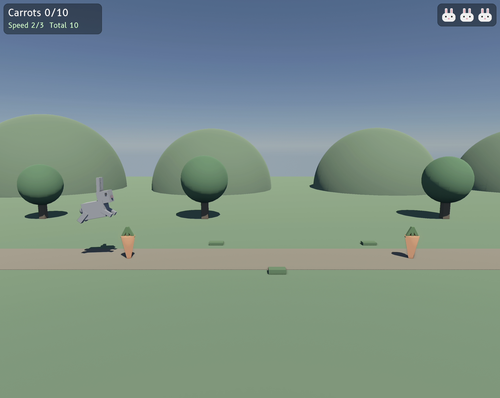
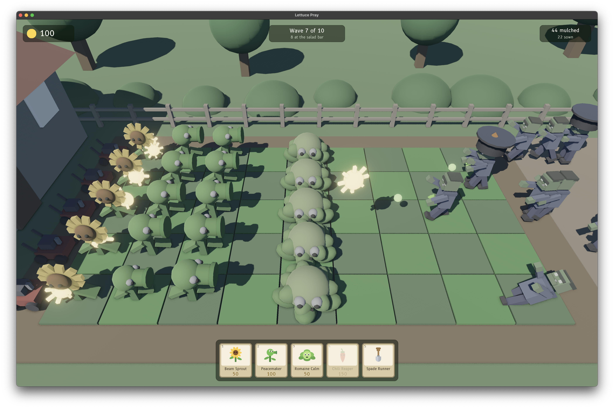
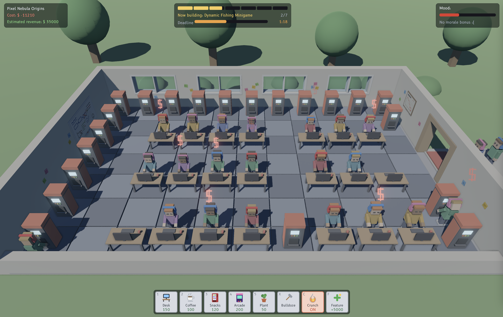
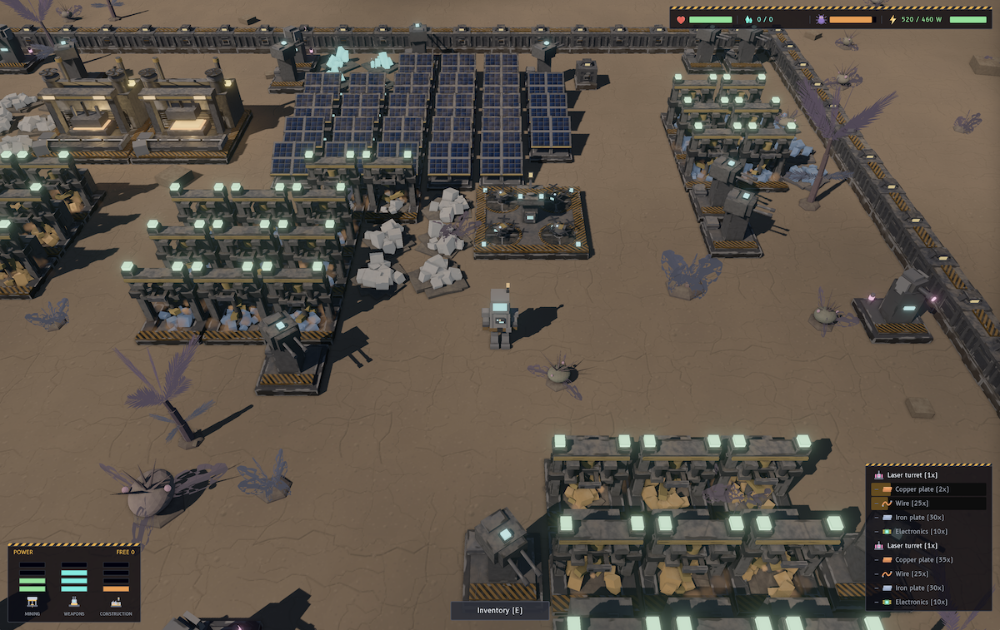

# Flecs games
A repository with example games, to help with building [Flecs](https://github.com/SanderMertens/flecs) games.

Building the games is currently not possible, because the renderer, UI and input systems are not open source. This may change in the future.

## Games
Click on the image to play!

## Bunny Hopper
Save the bunny by avoiding the carrots!

## Lettuce Pray
Plants vs. zombies in ECS.

## Ship Happens
Hire developers, keep them happy, ship a game, profit.

## Ore Else
Mine as much luminite, ship it off planet, and fight off the locals until it's time to evacuate.

## Assets
All of the assets are created from scratch and are included in the game/etc folders.
